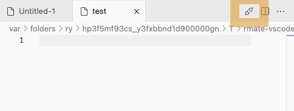
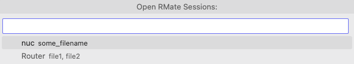

# RMate for VS Code

A package that implements the TextMate's 'rmate' feature for Visual Studio Code.

This is a fork of [rafaelmaiolla/remote-vscode](https://github.com/rafaelmaiolla/remote-vscode) fixing some features that probably almost nobody noticed they exist, for e.g.:

- Open multiple files at once with `rmate file1 file2`
- Closing files with `-w` flag which is useful for using rmate in `EDITOR`-env variable.
  Example: `EDITOR='rmate -w' sudoedit somefile`
  Due to a limitation in VS Code API (currently there's no API that would notify our Extetnsion when the user closed a Tab) we implemented a buttton here to alternatively close the Tab and the rmate-Session behind:  
  
  Alternatively there's a command for closing single Sessions or all Sessions at once:  
  


## Installation

* Install the package from the editor's extension manager.
* Install a rmate version
 - Ruby version: https://github.com/textmate/rmate
 - Bash version: https://github.com/aurora/rmate
 - Perl version: https://github.com/davidolrik/rmate-perl
 - Python version: https://github.com/sclukey/rmate-python
 - Nim version: https://github.com/aurora/rmate-nim
 - C version: https://github.com/hanklords/rmate.c
 - Node.js version: https://github.com/jrnewell/jmate
 - Golang version: https://github.com/mattn/gomate


## Usage

* Configure the extension in VS Code Settings:

* Start the server in the command palette - Press <kbd>F1</kbd> or <kbd>⌘ Command</kbd> + <kbd>⇧ Shift</kbd> + <kbd>P</kbd> and type `rmate: Start server`, and press <kbd>⏎ Enter</kbd> to start the server.
  If successfully started you'll see a symbol in Status Bar:
  

* Login to your remote server with a remote port tunnel
  ```bash
  ssh -R 52698:127.0.0.1:52698 user@example.org
  ```
  
  Or configure SSH to always create a tunnel by editing `~/.ssh/config`:
  ```
  Host *
    RemoteForward 52698 127.0.0.1:52698
  ```

* Go to the remote system and run
  ```bash
  rmate file1 file2
  ```

* If you want to use rmate in `EDITOR` variable, you can use it like this:
  ```
  EDITOR='rmate -w' sudoedit important_file
  ```


## License
[MIT](LICENSE.txt)
